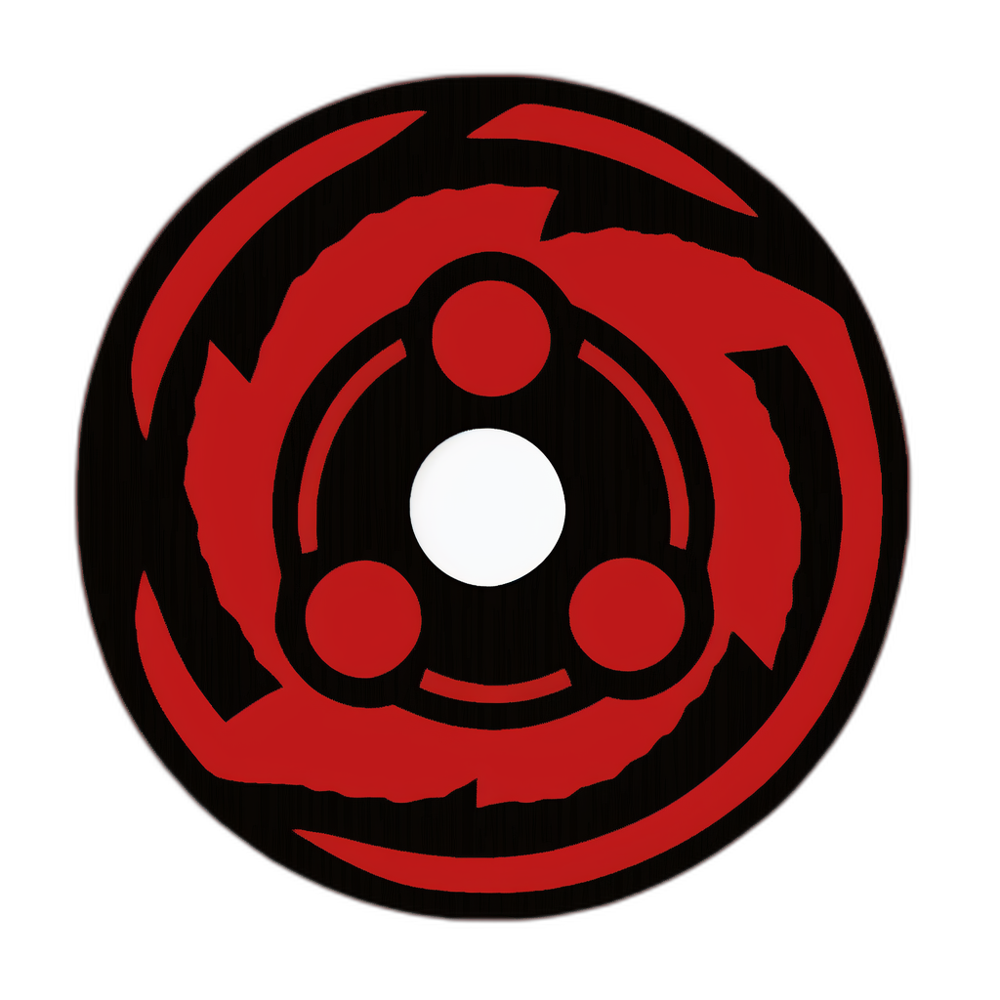

<!-- prettier-ignore-start -->
<!-- markdownlint-disable -->

  

 
<!-- markdownlint-restore -->
<!-- prettier-ignore-end -->

# ⚡ Madara: Starknet Sequencer on Substrate 🦀

Welcome to **Madara**, a blazing fast ⚡ [Starknet](https://www.starknet.io/) sequencer
 designed to make your projects soar!

Built on the robust Substrate framework and fast, thanks to Rust 🦀,
Madara delivers unmatched performance and scalability to power
 your Starknet-based Validity Rollup chain.

Dive into the world of Madara and join our passionate community of contributors!
Together, we're pushing the boundaries of what's possible within the Starknet ecosystem.

🚀 Discover the unparalleled flexibility and might of Madara,
your gateway to launching your very own Starknet appchain or L3.
Harness the prowess of Cairo, while maintaining complete control
over your custom appchain, tailored to your specific requirements.
Madara is designed to empower a multitude of projects, fueling
growth within the Starknet ecosystem.

## 🌟 Features

- Starknet sequencer 🐺
- Built on Substrate 🌐
- Rust-based for safety and performance 🏎️
- Custom FRAME pallets for Starknet functionality 🔧
- Comprehensive documentation 📚
- Active development and community support 🤝

## 📚 Documentation

Get started with our comprehensive documentation, which covers everything from
project structure and architecture to benchmarking and running Madara:

- [Architecture Overview](./docs/architecture.md)
- [Project Structure](./docs/project-structure.md)
- [Getting Started Guide](./docs/getting-started.md)
- [Run benchmark yourself](./benchmarking/README.md)

## 🏗️ Build & Run

Want to dive straight in? Check out our
[Getting Started Guide](./docs/getting-started.md) for instructions on how to
build and run Madara on your local machine.

## Benchmarking

Benchmarking is an essential process in our project development lifecycle,
as it helps us to track the performance evolution of Madara over time.
It provides us with valuable insights into how well Madara handles transaction throughput,
 and whether any recent changes have impacted performance.

You can follow the evolution of Madara's performance by visiting our [Benchmark Page](https://keep-starknet-strange.github.io/madara/dev/bench/).

However, it's important to understand that the absolute numbers presented
on this page should not be taken as the reference or target numbers
for a production environment.
The benchmarks are run on a self-hosted GitHub runner,
 which may not represent the most powerful machine configurations in real-world
 production scenarios.

Therefore, these numbers primarily serve as a tool to track
the _relative_ performance changes over time.
They allow us to quickly identify and address any performance regressions,
and continuously optimize the system's performance.

In other words, while the absolute throughput numbers may not be reflective of
 a production environment, the relative changes and trends over time
 are what we focus on. This way, we can ensure that Madara is always improving,
 and that we maintain a high standard of performance as the project evolves.

## 🌐 Connect to the dev webapp

Once your Madara node is up and running, you can connect to the Polkadot-JS Apps
front-end to interact with your chain.
[Connect here!](https://polkadot.js.org/apps/#/explorer?rpc=ws://localhost:9944)

You can also connect to our customized fork of the Polkadot-JS Apps front-end,
 deployed on [Madara dev webapp](https://starknet-madara.netlify.app/#/explorer).

## 🤝 Contribute

We're always looking for passionate developers to join our community and
contribute to Madara. Check out our [contributing guide](./docs/CONTRIBUTING.md)
for more information on how to get started.

## 📖 License

This project is licensed under the **MIT license**.

See [LICENSE](LICENSE) for more information.

Happy coding! 🎉

## Contributors ✨

Thanks goes to these wonderful people
([emoji key](https://allcontributors.org/docs/en/emoji-key)):

<!-- ALL-CONTRIBUTORS-LIST:START - Do not remove or modify this section -->
<!-- prettier-ignore-start -->
<!-- markdownlint-disable -->
<table>
  <tbody>
    <tr>
      <td align="center" valign="top" width="14.28%"><a href="https://github.com/abdelhamidbakhta"> <b>Abdel @ StarkWare </b></a> <a href="https://github.com/keep-starknet-strange/madara/commits?author=abdelhamidbakhta" title="Code">💻</a></td>
      <td align="center" valign="top" width="14.28%"><a href="https://github.com/tdelabro"> <b>Timothée Delabrouille</b></a> <a href="https://github.com/keep-starknet-strange/madara/commits?author=tdelabro" title="Code">💻</a></td>
      <td align="center" valign="top" width="14.28%"><a href="https://github.com/EvolveArt"> <b>0xevolve</b></a> <a href="https://github.com/keep-starknet-strange/madara/commits?author=EvolveArt" title="Code">💻</a></td>
      <td align="center" valign="top" width="14.28%"><a href="https://github.com/LucasLvy"> <b>Lucas @ StarkWare</b></a> <a href="https://github.com/keep-starknet-strange/madara/commits?author=LucasLvy" title="Code">💻</a></td>
      <td align="center" valign="top" width="14.28%"><a href="https://github.com/DavideSilva"> <b>Davide Silva</b></a> <a href="https://github.com/keep-starknet-strange/madara/commits?author=DavideSilva" title="Code">💻</a></td>
      <td align="center" valign="top" width="14.28%"><a href="https://www.finiam.com/"> <b>Finiam</b></a> <a href="https://github.com/keep-starknet-strange/madara/commits?author=finiam" title="Code">💻</a></td>
      <td align="center" valign="top" width="14.28%"><a href="https://github.com/ZePedroResende"> <b>Resende</b></a> <a href="https://github.com/keep-starknet-strange/madara/commits?author=ZePedroResende" title="Code">💻</a></td>
    </tr>
    <tr>
      <td align="center" valign="top" width="14.28%"><a href="https://github.com/drspacemn"> <b>drspacemn</b></a> <a href="https://github.com/keep-starknet-strange/madara/commits?author=drspacemn" title="Code">💻</a></td>
      <td align="center" valign="top" width="14.28%"><a href="https://github.com/tarrencev"> <b>Tarrence van As</b></a> <a href="https://github.com/keep-starknet-strange/madara/commits?author=tarrencev" title="Code">💻</a></td>
      <td align="center" valign="top" width="14.28%"><a href="https://home.cse.ust.hk/~shanaj/"> <b>Siyuan Han</b></a> <a href="https://github.com/keep-starknet-strange/madara/commits?author=hsyodyssey" title="Documentation">📖</a></td>
      <td align="center" valign="top" width="14.28%"><a href="https://zediogoviana.github.io/"> <b>Zé Diogo</b></a> <a href="https://github.com/keep-starknet-strange/madara/commits?author=zediogoviana" title="Code">💻</a></td>
      <td align="center" valign="top" width="14.28%"><a href="https://github.com/Matth26"> <b>Matthias Monnier</b></a> <a href="https://github.com/keep-starknet-strange/madara/commits?author=Matth26" title="Code">💻</a></td>
      <td align="center" valign="top" width="14.28%"><a href="https://github.com/glihm"> <b>glihm</b></a> <a href="https://github.com/keep-starknet-strange/madara/commits?author=glihm" title="Code">💻</a></td>
      <td align="center" valign="top" width="14.28%"><a href="https://github.com/0xEniotna"> <b>Antoine</b></a> <a href="https://github.com/keep-starknet-strange/madara/commits?author=0xEniotna" title="Code">💻</a></td>
    </tr>
    <tr>
      <td align="center" valign="top" width="14.28%"><a href="https://www.linkedin.com/in/clementwalter/"> <b>Clément Walter</b></a> <a href="https://github.com/keep-starknet-strange/madara/commits?author=ClementWalter" title="Code">💻</a></td>
      <td align="center" valign="top" width="14.28%"><a href="https://github.com/Eikix"> <b>Elias Tazartes</b></a> <a href="https://github.com/keep-starknet-strange/madara/commits?author=Eikix" title="Code">💻</a></td>
      <td align="center" valign="top" width="14.28%"><a href="https://github.com/xJonathanLEI"> <b>Jonathan LEI</b></a> <a href="https://github.com/keep-starknet-strange/madara/commits?author=xJonathanLEI" title="Code">💻</a></td>
      <td align="center" valign="top" width="14.28%"><a href="https://github.com/greged93"> <b>greged93</b></a> <a href="https://github.com/keep-starknet-strange/madara/commits?author=greged93" title="Code">💻</a></td>
      <td align="center" valign="top" width="14.28%"><a href="https://github.com/dubzn"> <b>Santiago Galván (Dub)</b></a> <a href="https://github.com/keep-starknet-strange/madara/commits?author=dubzn" title="Code">💻</a></td>
      <td align="center" valign="top" width="14.28%"><a href="https://github.com/ftupas"> <b>ftupas</b></a> <a href="https://github.com/keep-starknet-strange/madara/commits?author=ftupas" title="Code">💻</a></td>
      <td align="center" valign="top" width="14.28%"><a href="https://github.com/phklive"> <b>Paul-Henry Kajfasz</b></a> <a href="https://github.com/keep-starknet-strange/madara/commits?author=phklive" title="Code">💻</a></td>
    </tr>
    <tr>
      <td align="center" valign="top" width="14.28%"><a href="https://github.com/chirag-bgh"> <b>chirag-bgh</b></a> <a href="https://github.com/keep-starknet-strange/madara/commits?author=chirag-bgh" title="Code">💻</a></td>
      <td align="center" valign="top" width="14.28%"><a href="https://github.com/danilowhk"> <b>danilowhk</b></a> <a href="https://github.com/keep-starknet-strange/madara/commits?author=danilowhk" title="Code">💻</a></td>
      <td align="center" valign="top" width="14.28%"><a href="https://github.com/bajpai244"> <b>Harsh Bajpai</b></a> <a href="https://github.com/keep-starknet-strange/madara/commits?author=bajpai244" title="Code">💻</a></td>
      <td align="center" valign="top" width="14.28%"><a href="https://github.com/amanusk"> <b>amanusk</b></a> <a href="https://github.com/keep-starknet-strange/madara/commits?author=amanusk" title="Code">💻</a></td>
      <td align="center" valign="top" width="14.28%"><a href="https://github.com/dpinones"> <b>Damián Piñones</b></a> <a href="https://github.com/keep-starknet-strange/madara/commits?author=dpinones" title="Code">💻</a></td>
      <td align="center" valign="top" width="14.28%"><a href="https://github.com/marioiordanov"> <b>marioiordanov</b></a> <a href="https://github.com/keep-starknet-strange/madara/commits?author=marioiordanov" title="Code">💻</a></td>
      <td align="center" valign="top" width="14.28%"><a href="https://github.com/dbejarano820"> <b>Daniel Bejarano</b></a> <a href="https://github.com/keep-starknet-strange/madara/commits?author=dbejarano820" title="Code">💻</a></td>
    </tr>
    <tr>
      <td align="center" valign="top" width="14.28%"><a href="https://github.com/sparqet"> <b>sparqet</b></a> <a href="https://github.com/keep-starknet-strange/madara/commits?author=sparqet" title="Code">💻</a></td>
      <td align="center" valign="top" width="14.28%"><a href="https://github.com/robinstraub"> <b>Robin Straub</b></a> <a href="https://github.com/keep-starknet-strange/madara/commits?author=robinstraub" title="Code">💻</a></td>
      <td align="center" valign="top" width="14.28%"><a href="https://github.com/edisontim"> <b>tedison</b></a> <a href="https://github.com/keep-starknet-strange/madara/commits?author=edisontim" title="Code">💻</a></td>
      <td align="center" valign="top" width="14.28%"><a href="https://github.com/lana-shanghai"> <b>lanaivina</b></a> <a href="https://github.com/keep-starknet-strange/madara/commits?author=lana-shanghai" title="Code">💻</a></td>
      <td align="center" valign="top" width="14.28%"><a href="https://droak.sh/"> <b>Oak</b></a> <a href="https://github.com/keep-starknet-strange/madara/commits?author=d-roak" title="Code">💻</a></td>
      <td align="center" valign="top" width="14.28%"><a href="https://github.com/rkdud007"> <b>Pia</b></a> <a href="https://github.com/keep-starknet-strange/madara/commits?author=rkdud007" title="Code">💻</a></td>
      <td align="center" valign="top" width="14.28%"><a href="https://github.com/apoorvsadana"> <b>apoorvsadana</b></a> <a href="https://github.com/keep-starknet-strange/madara/commits?author=apoorvsadana" title="Code">💻</a></td>
    </tr>
    <tr>
      <td align="center" valign="top" width="14.28%"><a href="https://ceccon.me/"> <b>Francesco Ceccon</b></a> <a href="https://github.com/keep-starknet-strange/madara/commits?author=fracek" title="Code">💻</a></td>
      <td align="center" valign="top" width="14.28%"><a href="https://github.com/ptisserand"> <b>ptisserand</b></a> <a href="https://github.com/keep-starknet-strange/madara/commits?author=ptisserand" title="Code">💻</a></td>
      <td align="center" valign="top" width="14.28%"><a href="https://github.com/zizou0x"> <b>Zizou</b></a> <a href="https://github.com/keep-starknet-strange/madara/commits?author=zizou0x" title="Code">💻</a></td>
      <td align="center" valign="top" width="14.28%"><a href="https://github.com/makluganteng"> <b>V.O.T</b></a> <a href="https://github.com/keep-starknet-strange/madara/commits?author=makluganteng" title="Code">💻</a></td>
      <td align="center" valign="top" width="14.28%"><a href="https://github.com/MdTeach"> <b>Abishek Bashyal</b></a> <a href="https://github.com/keep-starknet-strange/madara/commits?author=MdTeach" title="Code">💻</a></td>
      <td align="center" valign="top" width="14.28%"><a href="https://github.com/kariy"> <b>Ammar Arif</b></a> <a href="https://github.com/keep-starknet-strange/madara/commits?author=kariy" title="Code">💻</a></td>
      <td align="center" valign="top" width="14.28%"><a href="https://github.com/lambda-0x"> <b>lambda-0x</b></a> <a href="https://github.com/keep-starknet-strange/madara/commits?author=lambda-0x" title="Code">💻</a></td>
    </tr>
    <tr>
      <td align="center" valign="top" width="14.28%"><a href="https://github.com/exp-table"> <b>exp_table</b></a> <a href="https://github.com/keep-starknet-strange/madara/commits?author=exp-table" title="Code">💻</a></td>
      <td align="center" valign="top" width="14.28%"><a href="https://github.com/Pilouche"> <b>Pilou</b></a> <a href="https://github.com/keep-starknet-strange/madara/commits?author=Pilouche" title="Code">💻</a></td>
    </tr>
  </tbody>
</table>

<!-- markdownlint-restore -->
<!-- prettier-ignore-end -->

<!-- ALL-CONTRIBUTORS-LIST:END -->

This project follows the
[all-contributors](https://github.com/all-contributors/all-contributors)
specification. Contributions of any kind welcome!
