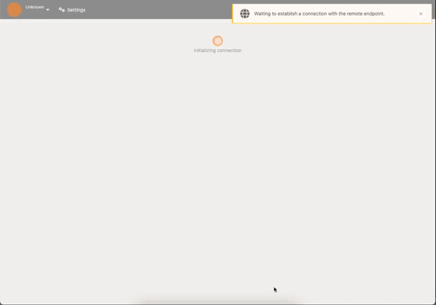

<div align="center">
  <h1>Kaioshin</h1>
  
  <br />
  <a href="https://github.com/keep-starknet-strange/kaioshin/issues/new?assignees=&labels=bug&template=01_BUG_REPORT.md&title=bug%3A+">Report a Bug</a>
  -
  <a href="https://github.com/keep-starknet-strange/kaioshin/issues/new?assignees=&labels=enhancement&template=02_FEATURE_REQUEST.md&title=feat%3A+">Request a Feature</a>
  -
  <a href="https://github.com/keep-starknet-strange/kaioshin/discussions">Ask a Question</a>
</div>

<div align="center">
<br />

[](https://github.com/keep-starknet-strange/kaioshin/actions/workflows/check.yml)
[](LICENSE)
[](https://github.com/keep-starknet-strange/kaioshin/issues?q=is%3Aissue+is%3Aopen+label%3A%22help+wanted%22)

</div>

## About

Kaioshin is a ⚡ blazing fast ⚡ Starknet sequencer, based on substrate and written in Rust 🦀.



## Architecture

`Kaioshin` is formed by those components:
- `node`: services for the blockchain node implementation (chain specification, rpc, ...)
- `pallets`: custom FRAME pallets
  - `pallet-cairo`: Cairo execution engine pallet.
  - `pallet-starknet`: Starknet pallet.
- `runtime`: assemble Kaioshin custom logic with the configured pallets.

Here is a high level overview of the current architecture of Starknet sequencer.


### Pallets

#### `pallet-cairo`

`pallet-cairo` is a pallet that provides a way to execute Cairo programs in a Substrate environment.

#### `pallet-starknet`

`pallet-starknet` is a pallet that provides a way to execute Starknet contracts in a Substrate environment.

## Getting Started

Follow the steps below to get started with Kaioshin :hammer_and_wrench:

### Using Nix

Install [nix](https://nixos.org/) and optionally [direnv](https://github.com/direnv/direnv) and
[lorri](https://github.com/nix-community/lorri) for a fully plug and play experience for setting up
the development environment. To get all the correct dependencies activate direnv `direnv allow` and
lorri `lorri shell`.

### Rust Setup

First, complete the [basic Rust setup instructions](./docs/rust-setup.md).

### Run

Use Rust's native `cargo` command to build and launch the template node:

```sh
cargo run --release -- --dev
```

Log level can be specified with `-l` flag. For example, `-ldebug` will show debug logs.
It can also be specified via the `RUST_LOG` environment variable. For example:
```sh
RUSTLOG=runtime=info cargo run --release -- --dev
```

### Build

The `cargo run` command will perform an initial build. Use the following command to build the node
without launching it:

```sh
cargo build --release
```

### Embedded Docs

Once the project has been built, the following command can be used to explore all parameters and
subcommands:

```sh
./target/release/kaioshin -h
```

## Run

The provided `cargo run` command will launch a temporary node and its state will be discarded after
you terminate the process. After the project has been built, there are other ways to launch the
node.

### Single-Node Development Chain

This command will start the single-node development chain with non-persistent state:

```bash
./target/release/kaioshin --dev
```

Purge the development chain's state:

```bash
./target/release/kaioshin purge-chain --dev
```

Start the development chain with detailed logging:

```bash
RUST_BACKTRACE=1 ./target/release/kaioshin -ldebug --dev
```

> Development chain means that the state of our chain will be in a tmp folder while the nodes are
> running. Also, **alice** account will be authority and sudo account as declared in the
> [genesis state](https://github.com/substrate-developer-hub/substrate-kaioshin/blob/main/node/src/chain_spec.rs#L49).
> At the same time the following accounts will be pre-funded:
> - Alice
> - Bob
> - Alice//stash
> - Bob//stash

In case of being interested in maintaining the chain' state between runs a base path must be added
so the db can be stored in the provided folder instead of a temporal one. We could use this folder
to store different chain databases, as a different folder will be created per different chain that
is ran. The following commands shows how to use a newly created folder as our db base path.

```bash
// Create a folder to use as the db base path
$ mkdir my-chain-state

// Use of that folder to store the chain state
$ ./target/release/kaioshin --dev --base-path ./my-chain-state/

// Check the folder structure created inside the base path after running the chain
$ ls ./my-chain-state
chains
$ ls ./my-chain-state/chains/
dev
$ ls ./my-chain-state/chains/dev
db keystore network
```


### Connect with Polkadot-JS Apps Front-end

Once the node template is running locally, you can connect it with **Polkadot-JS Apps** front-end
to interact with your chain. [Click
here](https://polkadot.js.org/apps/#/explorer?rpc=ws://localhost:9944) connecting the Apps to your
local node template.

### Multi-Node Local Testnet

If you want to see the multi-node consensus algorithm in action, refer to our
[Simulate a network tutorial](https://docs.substrate.io/tutorials/get-started/simulate-network/).

## Template Structure

A Substrate project such as this consists of a number of components that are spread across a few
directories.

### Node

A blockchain node is an application that allows users to participate in a blockchain network.
Substrate-based blockchain nodes expose a number of capabilities:

- Networking: Substrate nodes use the [`libp2p`](https://libp2p.io/) networking stack to allow the
  nodes in the network to communicate with one another.
- Consensus: Blockchains must have a way to come to
  [consensus](https://docs.substrate.io/main-docs/fundamentals/consensus/) on the state of the
  network. Substrate makes it possible to supply custom consensus engines and also ships with
  several consensus mechanisms that have been built on top of
  [Web3 Foundation research](https://research.web3.foundation/en/latest/polkadot/NPoS/index.html).
- RPC Server: A remote procedure call (RPC) server is used to interact with Substrate nodes.

There are several files in the `node` directory - take special note of the following:

- [`chain_spec.rs`](./node/src/chain_spec.rs): A
  [chain specification](https://docs.substrate.io/main-docs/build/chain-spec/) is a
  source code file that defines a Substrate chain's initial (genesis) state. Chain specifications
  are useful for development and testing, and critical when architecting the launch of a
  production chain. Take note of the `development_config` and `testnet_genesis` functions, which
  are used to define the genesis state for the local development chain configuration. These
  functions identify some
  [well-known accounts](https://docs.substrate.io/reference/command-line-tools/subkey/)
  and use them to configure the blockchain's initial state.
- [`service.rs`](./node/src/service.rs): This file defines the node implementation. Take note of
  the libraries that this file imports and the names of the functions it invokes. In particular,
  there are references to consensus-related topics, such as the
  [block finalization and forks](https://docs.substrate.io/main-docs/fundamentals/consensus/#finalization-and-forks)
  and other [consensus mechanisms](https://docs.substrate.io/main-docs/fundamentals/consensus/#default-consensus-models)
  such as Aura for block authoring and GRANDPA for finality.

After the node has been [built](#build), refer to the embedded documentation to learn more about the
capabilities and configuration parameters that it exposes:

```shell
./target/release/kaioshin --help
```

### Runtime

In Substrate, the terms
"runtime" and "state transition function"
are analogous - they refer to the core logic of the blockchain that is responsible for validating
blocks and executing the state changes they define. The Substrate project in this repository uses
[FRAME](https://docs.substrate.io/main-docs/fundamentals/runtime-intro/#frame) to construct a
blockchain runtime. FRAME allows runtime developers to declare domain-specific logic in modules
called "pallets". At the heart of FRAME is a helpful
[macro language](https://docs.substrate.io/reference/frame-macros/) that makes it easy to
create pallets and flexibly compose them to create blockchains that can address
[a variety of needs](https://substrate.io/ecosystem/projects/).

Review the [FRAME runtime implementation](./runtime/src/lib.rs) included in this template and note
the following:

- This file configures several pallets to include in the runtime. Each pallet configuration is
  defined by a code block that begins with `impl $PALLET_NAME::Config for Runtime`.
- The pallets are composed into a single runtime by way of the
  [`construct_runtime!`](https://crates.parity.io/frame_support/macro.construct_runtime.html)
  macro, which is part of the core
  FRAME Support [system](https://docs.substrate.io/reference/frame-pallets/#system-pallets) library.

### Pallets

The runtime in this project is constructed using many FRAME pallets that ship with the
[core Substrate repository](https://github.com/paritytech/substrate/tree/master/frame) and a
template pallet that is [defined in the `pallets`](./pallets/template/src/lib.rs) directory.

A FRAME pallet is compromised of a number of blockchain primitives:

- Storage: FRAME defines a rich set of powerful
  [storage abstractions](https://docs.substrate.io/main-docs/build/runtime-storage/) that makes
  it easy to use Substrate's efficient key-value database to manage the evolving state of a
  blockchain.
- Dispatchables: FRAME pallets define special types of functions that can be invoked (dispatched)
  from outside of the runtime in order to update its state.
- Events: Substrate uses [events and errors](https://docs.substrate.io/main-docs/build/events-errors/)
  to notify users of important changes in the runtime.
- Errors: When a dispatchable fails, it returns an error.
- Config: The `Config` configuration interface is used to define the types and parameters upon
  which a FRAME pallet depends.

### Run in Docker

First, install [Docker](https://docs.docker.com/get-docker/) and
[Docker Compose](https://docs.docker.com/compose/install/).

Then run the following command to start a single node development chain.

```bash
./scripts/docker_run.sh
```

This command will firstly compile your code, and then start a local development network. You can
also replace the default command
(`cargo build --release && ./target/release/kaioshin --dev --ws-external`)
by appending your own. A few useful ones are as follow.

```bash
# Run Substrate node without re-compiling
./scripts/docker_run.sh ./target/release/kaioshin --dev --ws-external

# Purge the local dev chain
./scripts/docker_run.sh ./target/release/kaioshin purge-chain --dev

# Check whether the code is compilable
./scripts/docker_run.sh cargo check
```

## Roadmap

See the [open issues](https://github.com/keep-starknet-strange/kaioshin/issues) for
a list of proposed features (and known issues).

- [Top Feature Requests](https://github.com/keep-starknet-strange/kaioshin/issues?q=label%3Aenhancement+is%3Aopen+sort%3Areactions-%2B1-desc)
  (Add your votes using the 👍 reaction)
- [Top Bugs](https://github.com/keep-starknet-strange/kaioshin/issues?q=is%3Aissue+is%3Aopen+label%3Abug+sort%3Areactions-%2B1-desc)
  (Add your votes using the 👍 reaction)
- [Newest Bugs](https://github.com/keep-starknet-strange/kaioshin/issues?q=is%3Aopen+is%3Aissue+label%3Abug)

## Support

Reach out to the maintainer at one of the following places:

- [GitHub Discussions](https://github.com/keep-starknet-strange/kaioshin/discussions)
- Contact options listed on
  [this GitHub profile](https://github.com/keep-starknet-strange)

## Project assistance

If you want to say **thank you** or/and support active development of Kaioshin:

- Add a [GitHub Star](https://github.com/keep-starknet-strange/kaioshin) to the
  project.
- Tweet about the Kaioshin.
- Write interesting articles about the project on [Dev.to](https://dev.to/),
  [Medium](https://medium.com/) or your personal blog.

Together, we can make Kaioshin **better**!

## Contributing

First off, thanks for taking the time to contribute! Contributions are what make
the open-source community such an amazing place to learn, inspire, and create.
Any contributions you make will benefit everybody else and are **greatly
appreciated**.

Please read [our contribution guidelines](docs/CONTRIBUTING.md), and thank you
for being involved!

## Authors & contributors

For a full list of all authors and contributors, see
[the contributors page](https://github.com/keep-starknet-strange/kaioshin/contributors).

## Security

Kaioshin follows good practices of security, but 100% security cannot be assured.
Kaioshin is provided **"as is"** without any **warranty**. Use at your own risk.

_For more information and to report security issues, please refer to our
[security documentation](docs/SECURITY.md)._

## License

This project is licensed under the **MIT license**.

See [LICENSE](LICENSE) for more information.

## Troubleshooting

### error: failed to run custom build command for `libp2p-core v0.37.0` / Could not find `protoc` installation
<details>
<summary>Click to expand</summary>

#### Error 
```text
error: failed to run custom build command for `libp2p-core v0.37.0`

Caused by:
  process didn't exit successfully: `...` (exit status: 101)
  --- stderr
  thread 'main' panicked at 'Could not find `protoc` installation and this build crate cannot proceed without
      this knowledge. If `protoc` is installed and this crate had trouble finding
      it, you can set the `PROTOC` environment variable with the specific path to your
      installed `protoc` binary.You could try running `brew install protobuf` or downloading it from https://github.com/protocolbuffers/protobuf/releases

  For more information: https://docs.rs/prost-build/#sourcing-protoc
  ', /Users/abdel/.cargo/registry/src/github.com-1ecc6299db9ec823/prost-build-0.11.4/src/lib.rs:1296:10
  note: run with `RUST_BACKTRACE=1` environment variable to display a backtrace
```

#### Solution

It means that you don't have `protoc` installed on your machine. You can install it using `brew install protobuf` on MacOs or downloading it from https://github.com/protocolbuffers/protobuf/releases.

</details>

###  Rust WASM toolchain not installed, please install it!
<details>
<summary>Click to expand</summary>

#### Error 
```text
error: failed to run custom build command for `kaioshin-runtime v4.0.0-dev (/Users/abdel/dev/me/kaioshin/runtime)`

Caused by:
  process didn't exit successfully: `.../kaioshin/target/release/build/kaioshin-runtime-9df5c70f9d1b72f5/build-script-build` (exit status: 1)
  --- stderr
  Rust WASM toolchain not installed, please install it!

  Further error information:
  ------------------------------------------------------------
     Compiling wasm-test v1.0.0 (/var/folders/...)
  error[E0463]: can't find crate for `std`
    |
    = note: the `wasm32-unknown-unknown` target may not be installed
    = help: consider downloading the target with `rustup target add wasm32-unknown-unknown`
    = help: consider building the standard library from source with `cargo build -Zbuild-std`
```

#### Solution

It means that you don't have `wasm32-unknown-unknown` target installed on your machine. You can install it using `rustup target add wasm32-unknown-unknown`.

</details>

## Acknowledgements
## Contributors ✨

Thanks goes to these wonderful people ([emoji key](https://allcontributors.org/docs/en/emoji-key)):

<!-- ALL-CONTRIBUTORS-LIST:START - Do not remove or modify this section -->
<!-- prettier-ignore-start -->
<!-- markdownlint-disable -->
<table>
  <tbody>
    <tr>
      <td align="center" valign="top" width="14.28%"><a href="https://github.com/abdelhamidbakhta"><br /><sub><b>Abdel @ StarkWare </b></sub></a><br /><a href="https://github.com/keep-starknet-strange/kaioshin/commits?author=abdelhamidbakhta" title="Code">💻</a></td>
      <td align="center" valign="top" width="14.28%"><a href="https://github.com/tdelabro"><br /><sub><b>Timothée Delabrouille</b></sub></a><br /><a href="https://github.com/keep-starknet-strange/kaioshin/commits?author=tdelabro" title="Code">💻</a></td>
      <td align="center" valign="top" width="14.28%"><a href="https://github.com/EvolveArt"><br /><sub><b>0xevolve</b></sub></a><br /><a href="https://github.com/keep-starknet-strange/kaioshin/commits?author=EvolveArt" title="Code">💻</a></td>
      <td align="center" valign="top" width="14.28%"><a href="https://github.com/LucasLvy"><br /><sub><b>Lucas @ StarkWare</b></sub></a><br /><a href="https://github.com/keep-starknet-strange/kaioshin/commits?author=LucasLvy" title="Code">💻</a></td>
    </tr>
  </tbody>
</table>

<!-- markdownlint-restore -->
<!-- prettier-ignore-end -->

<!-- ALL-CONTRIBUTORS-LIST:END -->

This project follows the [all-contributors](https://github.com/all-contributors/all-contributors) specification. Contributions of any kind welcome!