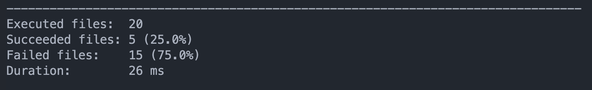
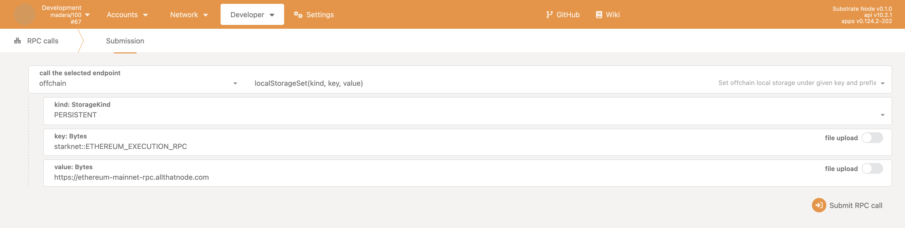
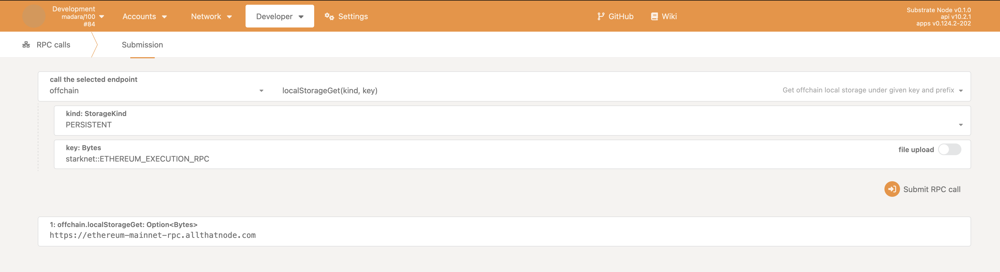

## Getting Started

Follow the steps below to get started with Madara :hammer_and_wrench:

### Rust Setup

First, Install rust using the [rustup](https://rustup.rs/) toolchain installer,
then run:

```bash
rustup show
```

### Cargo Run

Use Rust's native `cargo` command to build and launch the template node:

```sh
cargo run --release -- --dev
```

The node also supports to use manual seal (to produce block manually through
RPC). This is also used by the typescript tests:

```sh
$ cargo run --release -- --dev --sealing=manual
# Or
$ cargo run --release -- --dev --sealing=instant
```

Log level can be specified with `-l` flag. For example, `-ldebug` will show
debug logs. It can also be specified via the `RUST_LOG` environment variable.
For example:

```sh
RUSTLOG=runtime=info cargo run --release -- --dev
```

### Cargo Build

The `cargo run` command will perform an initial build. Use the following command
to build the node without launching it:

```sh
cargo build --release
```

You can optionally specify the compiler version for the build:

```sh
COMPILER_VERSION=0.12.0 cargo build --release
```

### Using Nix (optional, only for degens)

Install [nix](https://nixos.org/) and optionally
[direnv](https://github.com/direnv/direnv) and
[lorri](https://github.com/nix-community/lorri) for a fully plug and play
experience for setting up the development environment. To get all the correct
dependencies activate direnv `direnv allow` and lorri `lorri shell`.

### Embedded Docs

Once the project has been built, the following command can be used to explore
all parameters and subcommands:

```sh
./target/release/madara -h
```

## Run

The provided `cargo run` command will launch a temporary node and its state will
be discarded after you terminate the process. After the project has been built,
there are other ways to launch the node.

### Single-Node Development Chain

This command will start the single-node development chain with non-persistent
state:

```bash
./target/release/madara --dev
```

Purge the development chain's state:

```bash
./target/release/madara purge-chain --dev
```

Start the development chain with detailed logging:

```bash
RUST_BACKTRACE=1 ./target/release/madara -ldebug --dev
```

> Development chain means that the state of our chain will be in a tmp folder
> while the nodes are running. Also, **alice** account will be authority and
> sudo account as declared in the
> [genesis state](https://github.com/substrate-developer-hub/substrate-madara/blob/main/node/src/chain_spec.rs#L49).
> At the same time the following accounts will be pre-funded:
>
> - Alice
> - Bob
> - Alice//stash
> - Bob//stash

In case of being interested in maintaining the chain' state between runs a base
path must be added so the db can be stored in the provided folder instead of a
temporal one. We could use this folder to store different chain databases, as a
different folder will be created per different chain that is ran. The following
commands shows how to use a newly created folder as our db base path.

```bash
// Create a folder to use as the db base path
$ mkdir my-chain-state

// Use of that folder to store the chain state
$ ./target/release/madara --dev --base-path ./my-chain-state/

// Check the folder structure created inside the base path after running the chain
$ ls ./my-chain-state
chains
$ ls ./my-chain-state/chains/
dev
$ ls ./my-chain-state/chains/dev
db keystore network
```

### Connect with Polkadot-JS Apps Front-end

Once the node template is running locally, you can connect it with **Polkadot-JS
Apps** front-end to interact with your chain.
[Click here](https://polkadot.js.org/apps/#/explorer?rpc=ws://localhost:9944)
connecting the Apps to your local node template.

### Multi-Node Local Testnet

Build custom chain spec:

```bash
# Build plain chain spec
cargo run --release -- build-spec --chain local > infra/chain-specs/madara-local-testnet-plain.json
# Build final raw chain spec
cargo run --release -- build-spec --chain infra/chain-specs/madara-local-testnet-plain.json --raw > infra/chain-specs/madara-local-testnet.json
```

See more details about
[custom chain specs](https://docs.substrate.io/reference/how-to-guides/basics/customize-a-chain-specification/).

Run the local testnet:

```bash
./infra/local-testnet/run.sh
```

### Testing Madara RPC Endpoints

To test the Madara RPC endpoints, follow the steps below:

Run Madara locally (by default, it runs on port 9933):

```bash
cargo run --release -- --dev
# Alternatively, use other methods to run Madara
```

Execute hurl tests sequentially:

```bash
hurl --variables-file examples/rpc/hurl.config  --test examples/rpc/**/*.hurl
```

The output should be similar to the image provided:



### Set Ethereum Node URL for offchain worker

In order for the offchain worker to access an Ethereum RPC node, we need to set
the URL for that in offchain local storage. We can do that by making use of the
default
[`offchain` rpc calls](https://polkadot.js.org/docs/substrate/rpc/#offchain)
provided by Substrate.

In the polkadot explorer, navigate to Developer > RPC calls and choose the
`offchain` endpoint. In there, you can set the value for
`ETHEREUM_EXECUTION_RPC` by using the `localStorageSet` function. You need to
select the type of storage, in this case `PERSISTENT`, and use the
`starknet::ETHEREUM_EXECUTION_RPC` as the `key`. The value is the RPC URL you
intend to use.



You can check that the value was properly set by using the `localStorageGet`
function



### Run in Docker

First, install [Docker](https://docs.docker.com/get-docker/) and
[Docker Compose](https://docs.docker.com/compose/install/).

Then run the following command to start a single node development chain.

```bash
docker-compose -f infra/docker/docker-compose.yml up -d
```

This command will firstly compile your code, and then start a local development
network. You can also use the `docker_run.sh` script appending your own command.
A few useful ones are as follow.

```bash
# Run Substrate node without re-compiling
./infra/docker/docker_run.sh ./target/release/madara --dev --ws-external

# Purge the local dev chain
./infra/docker/docker_run.sh ./target/release/madara purge-chain --dev

# Check whether the code is compilable
./infra/docker/docker_run.sh cargo check
```
